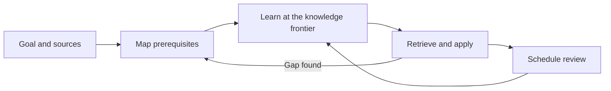

# Curriculer

**Learn anything. A curriculum builder & LLM tutor for any subject, using the best scientifically proven learning methods.**

## Why

Knowledge is not a list of facts. It is a graph of connected ideas and skills.
Advanced concepts depend on simpler concepts, so a weak prerequisite can make
later work slow or confusing. A single AI lesson cannot provide a complete path
through a large subject.

The curriculum holds the course plan in one place. Curriculer helps an LLM turn
a goal, suggested topics, and source material into an ordered course. The course
starts with prerequisites and builds toward the goal. If the learner has a gap,
the agent will automatically move back through the graph and reinforce it.

### Automaticity

Working memory is limited. If a basic skill needs conscious effort, less capacity
remains for complex work. Automaticity is the fast and reliable use of
lower-level knowledge. It frees attention for higher-level reasoning.

### Mastery

Mastery means that a learner can use a prerequisite with enough accuracy and
fluency to continue. Curriculer checks this before it adds more complexity. A
gap sends the learner back to the required knowledge or skill.

### Spaced Retrieval

Recall weakens without use. Rereading can feel familiar, but it does not always
produce reliable recall. Curriculer uses questions, exercises, and quizzes for
retrieval practice. It records each result and schedules the next review.
Successful reviews move farther apart. Difficult material returns sooner.



For more background, see Justin Skycak on
[prerequisite knowledge](https://www.justinmath.com/thoughts-about-prerequisite-knowledge/),
[automaticity](https://www.justinmath.com/cognitive-science-of-learning-developing-automaticity/),
[mastery learning](https://www.justinmath.com/a-brief-history-of-mastery-learning/), and
[spaced repetition](https://www.justinmath.com/cognitive-science-of-learning-spaced-repetition/).

## What

Curriculer is a Markdown-first scaffold for local course folders. A course can
contain a curriculum map, lessons, sources, exercises, flashcards, quizzes, a
glossary, progress, and review dates.

An LLM can teach from these files, quiz the learner, record evidence, and choose
the next task. The state stays visible and portable. No database, hosted service,
or application is required.

The repository contains `_Course Scaffold/`, the `course-study-coach` skill,
agent rules, and a scaffold validator.

The base repository does not contain real courses or learner history.

## How To Use It

Copy the scaffold into a separate learning workspace:

```sh
cp -R "_Course Scaffold" "/path/to/learning-workspace/My Course"
```

Then:

1. Open `00 Course Setup Grill.md` and define the goal, scope, and learner.
2. Add source material to `_attachments/` or give the agent suggested topics.
3. Ask the agent to map prerequisites and build the numbered course sections.
4. Use `course-study-coach` to learn, practice, review, and take quizzes.
5. Let the agent update progress and review dates from study evidence.

Example prompts:

```text
Build this course from my goal and source files.
Find where I left off and start the next useful task.
Quiz me on due material and update my review data.
```

Do not create real courses inside this base repository. Copy the scaffold first.

Before you change the scaffold, run:

```sh
python3 scripts/validate_curriculer.py --mode scaffold
```

See [CONTRIBUTING.md](CONTRIBUTING.md) for contribution rules.

## License

MIT. See [LICENSE](LICENSE).
