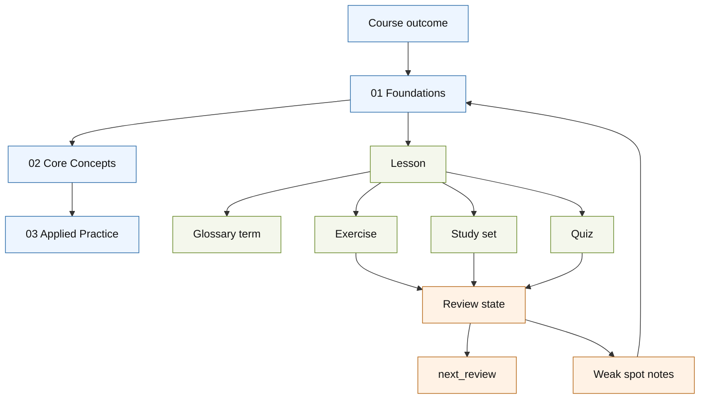
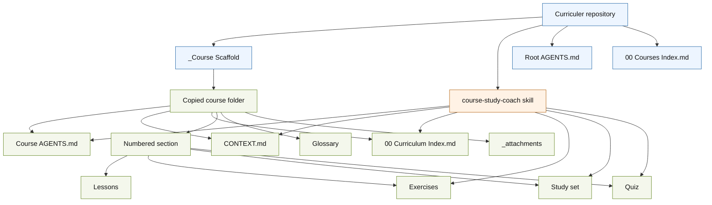
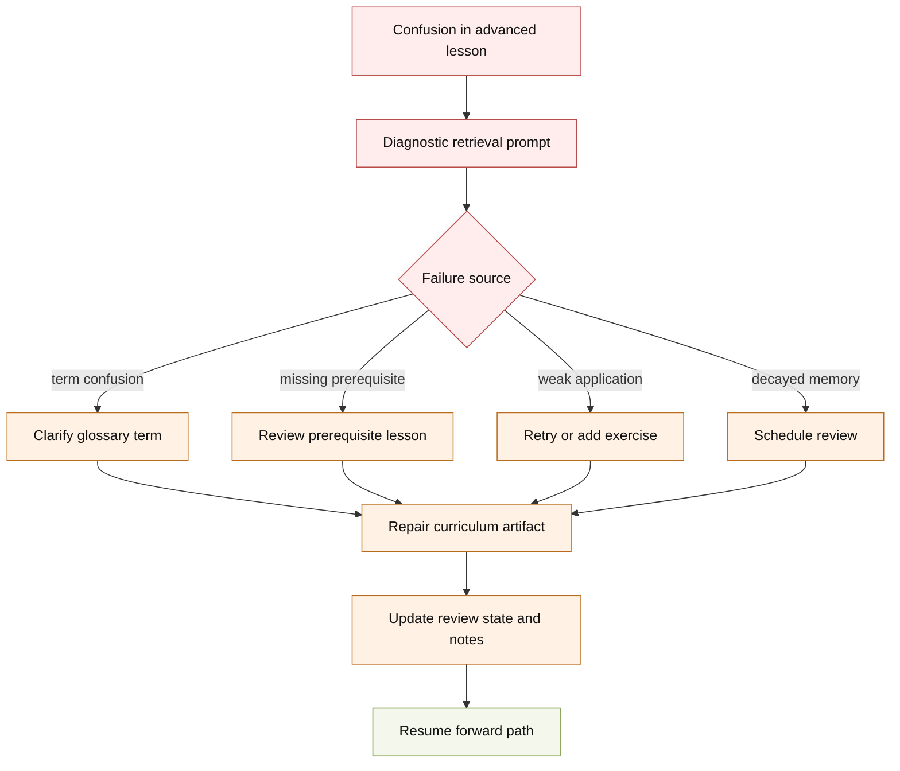

# Curriculer

Curriculer is a Markdown-first, LLM-assisted course workspace for building coherent, personalized curricula instead of isolated AI lessons.

It exists because AI can now generate explanations, drills, flashcards, mini-courses, and tutoring sessions on demand, but those artifacts often arrive as disconnected fragments. They may fill an immediate gap, but they do not reliably answer the harder educational questions:

- What should the learner already know before this lesson?
- Which earlier concept is failing when a newer concept feels confusing?
- Which terms need stable definitions?
- Which ideas have been recalled recently, and which are decaying?
- What should be reviewed before adding more material?
- How does this one lesson fit into the whole course?

Curriculer treats a course as a living learning system: a curriculum map, a shared course language, lessons, exercises, flashcards, quizzes, glossary terms, source material, and review state that an LLM can read and update over time. The learner does not just ask for "a lesson on X." The learner studies inside a structured workspace where new material can be connected to prerequisites, weak foundations can be repaired, and review can be scheduled instead of left to chance.

## Repository Status

This repository is the public base for Curriculer course workspaces. It ships:

- `_Course Scaffold/`, the reusable template for new courses.
- `.codex/skills/course-study-coach/`, a repo-scoped Codex skill for active-recall study sessions, reviews, exercises, study sets, quizzes, hints, diagnostic checks, and review metadata updates.
- `AGENTS.md`, the repository-level operating instructions for LLM agents working inside Curriculer.
- `00 Courses Index.md`, a simple top-level index for course libraries.

Curriculer is intentionally plain. It does not require a database, hosted service, LMS, or proprietary file format. A course is a folder of Markdown, simple embedded HTML, and source attachments that can be used in Obsidian, edited in any text editor, and studied with an LLM.

## The Problem

Modern AI tutoring has made content generation cheap. That is useful, but it creates a new failure mode: learning can become a pile of local optimizations.

A learner asks for a mini-course on a concept. The model gives a polished sequence. Later the learner asks for help with a related topic. The model gives another polished sequence. Each answer may be helpful in isolation, but the learning history is fragmented:

- The new lesson may not know which terminology the earlier lessons used.
- It may not know the learner's actual weak spots.
- It may not know which prerequisite was assumed but never mastered.
- It may not know which ideas are due for retrieval practice.
- It may not know which source material the course should trust.
- It may not maintain a durable path from beginner knowledge to advanced application.

The result is "helpful chaos": many small teaching moments, but no stable curriculum.

Curriculer is built around the opposite assumption. The unit of serious learning is not the prompt, the answer, the flashcard, or the single lesson. The unit is the curriculum: a structured body of knowledge with dependencies, review loops, definitions, exercises, and evidence of mastery.

## Why A Curriculum Matters

A curriculum is not just a table of contents. A good curriculum is an ordered learning graph. It gives the learner a path forward, but it also gives them a way to move backward when understanding breaks.

When a learner struggles with an advanced topic, the problem is often not the advanced topic itself. The problem is a missing prerequisite, a confused term, a brittle mental model, or a skill that was recognized once but never retrieved again. Curriculer makes those foundations inspectable.

In Curriculer, a course can ask:

- Which section introduced the prerequisite?
- Which lesson defined the term?
- Which exercise proved the learner could apply it?
- Which quiz exposed the misunderstanding?
- Which flashcards or exercises are due for review?
- Which glossary entry should be strengthened?
- Which earlier lesson should be repaired before moving on?

This is the core thesis: durable learning depends on the integrity of the prerequisite structure. If the foundational axioms are weak, later knowledge becomes decorative. It may sound fluent, but it will not transfer reliably.

Curriculer gives an LLM a persistent structure it can use to backtrack through that prerequisite structure in real time.

The curriculum is best understood as a graph, not a content list:



## What Curriculer Provides

Curriculer is small, but the pieces are designed to work together.

### Course Scaffold

`_Course Scaffold/` is the template copied for each new course. A mature course usually contains:

- `AGENTS.md` for course-specific agent instructions.
- `CONTEXT.md` for course language, scope, and decisions.
- `00 Curriculum Index.md` as the course map.
- Numbered section folders such as `01 Foundations`.
- Section-level lesson notes.
- Section-level `exercises/Exercises.md`.
- Section-level `flashcards/Flashcards.md`.
- Section-level `quizes/Quiz.md` and `quizes/Quiz.html`.
- `Glossary/00 Glossary Index.md` for stable learner-facing definitions.
- `_attachments/` for PDFs, screenshots, datasets, notes, source files, or other material.
- `00 Review Dashboard.md` for Dataview-friendly review queries.
- `00 Course Setup Grill.md` for clarifying a course before building it.

The folder spelling `quizes` is preserved for compatibility with existing course libraries that already use that spelling.

The workspace shape is deliberately simple:



### Course Study Coach Skill

Curriculer ships a repo-scoped Codex skill at:

```text
.codex/skills/course-study-coach/SKILL.md
```

The skill runs LLM-led study sessions using active recall, spaced review, exercises, study sets, quizzes, hints, and review metadata updates. It is designed to be invoked when the learner asks to study, review, continue a course, be quizzed, find where they left off, or practice material.

The core rule of the skill is that the learner must attempt retrieval before receiving clues, explanations, examples, or answers. This is important. Curriculer is not optimized for passive reading; it is optimized for repeated attempts to retrieve, apply, distinguish, correct, and transfer knowledge.

The study coach:

- selects the relevant course
- reads the course's `AGENTS.md`, `CONTEXT.md`, and curriculum index
- finds the learner's last checkpoint from lesson frontmatter
- prefers due or overdue reviews before new material
- asks diagnostic questions when the starting level is uncertain
- uses a hint ladder instead of immediately giving away answers
- updates lesson progress metadata after study sessions
- updates review metadata for exercises, study sets, and quizzes
- records weak spots in short actionable notes

This makes the study agent part of the curriculum, not a one-off chat behavior.

### Shared Course Language

Each course has a `CONTEXT.md` file. This is not a diary, implementation note, or loose scratchpad. It is the course-building language contract for LLMs.

It defines terms such as:

- Course
- Section
- Lesson
- Study Set
- Quiz
- Glossary
- Review State
- Confidence
- Mastered
- Needs Review
- Needs Practice

That shared language prevents an LLM from slowly drifting between words like "module," "unit," "chapter," "deck," "test," and "progress" when the course has chosen precise terms. The point is not pedantry. Stable language lets agents make consistent edits across many sessions.

### Curriculum Index

`00 Curriculum Index.md` is the course map. It tells the learner and the LLM what the course is for, how the sections relate, and where study should continue.

This matters because generated lessons are easy to create but hard to sequence well. Curriculer makes sequencing explicit. The course can grow from real learner needs, but it still has a map.

### Lessons

Lessons are small Markdown notes. A good lesson teaches one concept, operation, or skill, then gives the learner a concrete way to use it.

The scaffold lesson template includes:

- Core Idea
- Why It Matters
- Example
- Common Mistake
- Practice
- Study Notes

Lessons also have progress frontmatter:

```yaml
---
title: "Lesson Title"
section: "01 Section Name"
source:
order: 1.1
study_status: not started
last_studied:
study_count: 0
---
```

This lets an LLM find where the learner left off without relying on memory from a previous chat.

### Exercises

Exercises are for applied performance. They should ask the learner to produce something: an answer, command, explanation, diagram, query, solution, artifact, or decision.

Curriculer includes exercises in review metadata because durable learning is not only about recalling definitions. Applied skills also decay. If the learner cannot use an idea later, the course should know that.

### Flashcards

Flashcards live in section-level study sets. They use Obsidian-friendly collapsible HTML:

```html
<details>
<summary>Question?</summary>

Answer.

</details>
```

Curriculer prefers recall prompts over recognition prompts. A weak card asks "What is X?" A stronger card asks the learner to distinguish X from a nearby concept, predict what happens in a scenario, repair a common mistake, or explain why a procedure works.

### Quizzes

Each section can have a Markdown quiz wrapper and a self-contained HTML quiz:

```text
quizes/Quiz.md
quizes/Quiz.html
```

`Quiz.md` embeds `Quiz.html` for Obsidian. The HTML remains self-contained so it can also be opened directly in a browser.

### Glossary

The glossary is learner-facing. It is for subject terms, not agent implementation notes.

The glossary starts empty. Terms are added when the learner asks for them, when a term becomes central across multiple lessons, or when confusing that term with a nearby concept would cause real misunderstanding.

This keeps the course from becoming either too sparse or too encyclopedic. The glossary should stabilize the concepts that matter.

### Attachments

`_attachments/` stores course assets and source material:

- PDFs
- screenshots
- diagrams
- datasets
- notes
- code samples
- transcripts
- exported source files

Curriculer treats source policy as part of course design. The setup grill asks which sources the course should trust, and generated explanations should remain secondary to canonical material when the course has canonical sources.

## The Learning Model

Curriculer is designed around several overlapping ideas from cognitive psychology, instructional design, and practical tutoring.

### Active Recall Before Explanation

The learner should try to retrieve or apply knowledge before receiving the answer.

This is why the study coach asks questions first, waits for an attempt, and only then gives hints or explanations. Retrieval changes the learning event. It reveals what the learner can actually access, not just what feels familiar while reading.

### Spaced Review

Curriculer uses review metadata to schedule future contact with material. The default fields are:

```yaml
last_reviewed:
next_review:
review_count: 0
confidence: 0
status: not started
notes:
```

The default confidence schedule is intentionally simple:

- `0` or `1`: `needs practice`, review tomorrow.
- `2` or `3`: `needs review`, review in 3 days.
- `4`: `needs review`, review in 7 days.
- `5`: `mastered`, review in 14 to 30 days.

This is not trying to be a perfect memory algorithm. It is trying to make review visible, lightweight, editable, and agent-operable.

The study loop is intentionally visible and editable:

```mermaid
flowchart LR
  Start["Study session"] --> Due{"Due review?"}
  Due -- "yes" --> Prompt["Retrieval prompt"]
  Due -- "no" --> Lesson["Next lesson or weak spot"]
  Lesson --> Prompt

  Prompt --> Attempt["Learner attempt"]
  Attempt --> Eval{"Evidence"}
  Eval -- "clean" --> Mastered["mastered"]
  Eval -- "partial" --> Review["needs review"]
  Eval -- "missed" --> Practice["needs practice"]

  Mastered --> Long["Review in 14-30 days"]
  Review --> Soon["Review in 3-7 days"]
  Practice --> Tomorrow["Review tomorrow"]

  Long --> Update["Update frontmatter"]
  Soon --> Update
  Tomorrow --> Update
  Update --> Notes["Record weak spots"]
  Notes --> NextAction["Next review or lesson"]

  classDef action fill:#edf5ff,stroke:#2f6fab,stroke-width:1px,color:#111;
  classDef decision fill:#f7f7f7,stroke:#666,stroke-width:1px,color:#111;
  classDef state fill:#fff2e5,stroke:#b86b1d,stroke-width:1px,color:#111;
  class Start,Prompt,Attempt,Lesson,Update,Notes,NextAction action;
  class Due,Eval decision;
  class Mastered,Review,Practice,Long,Soon,Tomorrow state;
```



### Mastery Before Acceleration

Curriculer assumes that moving faster is not the same as learning better.

If a learner repeatedly misses the same idea, the course should not simply continue generating new lessons. It should repair the prerequisite: update a lesson, add an exercise, strengthen a glossary entry, schedule review, or ask diagnostic questions.

This reflects a mastery-learning posture: define what mastery means, check for it, give corrective practice, and only then build on top of it.

### Interleaving

Curriculer supports interleaving by letting a study session mix old review, new review, weak spots, and transfer prompts.

Blocked practice can feel fluent while hiding brittle understanding. Interleaving related concepts makes the learner choose between nearby ideas, which is often where real understanding becomes visible.

### Cognitive Load Management

The scaffold pushes lessons to stay small: one concept, operation, or skill at a time.

That does not mean the final course outcome must be small. It means complex skill acquisition should be decomposed, sequenced, practiced, and then reintegrated. Curriculer tries to keep each lesson within working memory while preserving the larger curriculum map.

### Prerequisite Backtracking

Curriculer is designed for the moment when the learner says, "I do not understand this," and the correct answer is not "read this explanation again."

Sometimes the right move is:

- go back two sections
- inspect the term that was overloaded
- review the exercise that was never mastered
- add a missing foundational lesson
- ask a diagnostic question
- repair the course map

The curriculum becomes a navigable prerequisite graph. The LLM can move forward when the learner is ready and backward when the foundation is cracked.

Backtracking is a normal part of study, not a failure case:



### Mistake-Driven Curriculum Repair

Mistakes are not only grading events. They are curriculum signals.

When a learner misses a question, gives a shallow explanation, confuses two terms, or needs a full hint ladder, Curriculer can respond by updating:

- review status
- confidence
- notes
- next review date
- flashcards
- exercises
- quiz questions
- glossary terms
- lesson explanations
- section sequencing

The course becomes more accurate as it is studied.

## Review States

Curriculer uses a small review vocabulary.

`not started` means the learner has not reviewed the artifact yet.

`needs practice` means the learner missed important ideas or needed substantial hints.

`needs review` means the learner mostly understood the material but should revisit it soon.

`mastered` means the learner recalled or applied the material cleanly without help.

These are not grades. They are routing labels. Their job is to decide what the learner should see next.

## How To Start A Course

1. Copy `_Course Scaffold/` to a new top-level folder named after the course.
2. Rename scaffold placeholders in the copied course:
   - `00 Curriculum Index.md`
   - `CONTEXT.md`
   - `AGENTS.md`
3. Open `00 Course Setup Grill.md` with an LLM.
4. Define the outcome, learner, boundaries, section plan, source policy, practice shape, quiz style, and completion standard.
5. Update `CONTEXT.md` as the course language becomes clear.
6. Replace `01 Section Template/` with real numbered sections.
7. Add lessons, exercises, flashcards, quizzes, glossary notes, and source attachments as the course develops.
8. Use `course-study-coach` for study sessions, review, diagnostics, and metadata updates.

## Course Setup Questions

The scaffold includes `00 Course Setup Grill.md` because course quality depends heavily on early framing.

The setup process asks:

- What should the learner be able to do after finishing?
- Who is the learner, and what can they already do?
- What belongs outside the course?
- What are the first 3 to 6 sections?
- How small should each lesson be?
- What should practice look like?
- What should exercises ask the learner to produce?
- What should flashcards test?
- What should quizzes test?
- What review cadence should the course use?
- Which sources should the course trust?
- What counts as finishing a section?
- When should the course be revised?
- Which terms deserve glossary notes?

This is where Curriculer differs from one-shot course generation. It does not just ask "What topic do you want?" It asks what learning path, evidence, boundaries, and review loop should exist.

## Using The Study Coach

In a Codex environment that loads repo-scoped skills, ask naturally:

```text
Use course-study-coach. I want to continue the Django course.
```

Or:

```text
Quiz me on the Postgres course and update review metadata afterward.
```

Or:

```text
Find where I left off and start with any overdue reviews.
```

The skill should inspect the course, prefer due reviews, ask one question at a time, avoid explaining before the first retrieval attempt, update lesson progress when appropriate, and update review metadata when there is enough evidence.

## Repository Layout

```text
.
|-- .codex/
|   `-- skills/
|       `-- course-study-coach/
|           `-- SKILL.md
|-- _Course Scaffold/
|   |-- 00 Course Setup Grill.md
|   |-- 00 Curriculum Index.md
|   |-- 00 Review Dashboard.md
|   |-- 01 Section Template/
|   |   |-- 00 Section Index.md
|   |   |-- 01 Lesson Template.md
|   |   |-- exercises/
|   |   |   `-- Exercises.md
|   |   |-- flashcards/
|   |   |   `-- Flashcards.md
|   |   `-- quizes/
|   |       |-- Quiz.md
|   |       `-- Quiz.html
|   |-- AGENTS.md
|   |-- CONTEXT.md
|   |-- Glossary/
|   |   `-- 00 Glossary Index.md
|   |-- README.md
|   |-- _attachments/
|   |   `-- README.md
|   `-- docs/
|       `-- adr/
|           `-- README.md
|-- 00 Courses Index.md
|-- AGENTS.md
`-- README.md
```

## Design Principles

### Markdown First

Markdown keeps courses portable, inspectable, and easy for both humans and LLMs to edit. The file tree is the application state.

### Agent Friendly

The repository gives agents explicit operating instructions, shared terminology, review rules, and course structure. This reduces the amount of hidden context a model has to infer.

### Local First

Courses can live in a local folder. Attachments, notes, quizzes, and review metadata stay with the course.

### Human Editable

Nothing important is hidden behind an opaque service. If the review date is wrong, edit it. If a lesson is weak, rewrite it. If a term is confusing, add a glossary note.

### Curriculum Over Content

The point is not to generate more material. The point is to preserve the structure that makes material learnable.

### Review As A First-Class Object

Review state is stored in frontmatter, not in the LLM's memory. That makes review portable across sessions and visible to the learner.

### Mistakes Improve The Course

A missed quiz question should not disappear into a chat transcript. It should update the course: notes, confidence, review dates, exercises, lessons, or glossary terms.

## What Curriculer Is Not

Curriculer is not a full LMS.

Curriculer is not an Anki clone.

Curriculer is not a hosted tutoring product.

Curriculer is not a guarantee that generated lessons are correct.

Curriculer is not a replacement for expert source material.

Curriculer is a durable workspace for making LLM-assisted learning less fragmented and more curriculum-shaped.

## Research Influences

Curriculer is a practical repo, not an academic paper. Still, its design is influenced by well-established learning-science ideas:

- Retrieval practice and the testing effect: see Roediger and Karpicke, ["Test-enhanced learning: taking memory tests improves long-term retention"](https://pubmed.ncbi.nlm.nih.gov/16507066/).
- Distributed practice: see Cepeda, Pashler, Vul, Wixted, and Rohrer, ["Distributed practice in verbal recall tasks"](https://pubmed.ncbi.nlm.nih.gov/16719566/).
- Effective study techniques: see Dunlosky, Rawson, Marsh, Nathan, and Willingham, ["Improving Students' Learning With Effective Learning Techniques"](https://journals.sagepub.com/doi/10.1177/1529100612453266).
- Interleaving and inductive learning: see Kornell and Bjork, ["Learning concepts and categories"](https://journals.sagepub.com/doi/abs/10.1111/j.1467-9280.2008.02127.x), and Birnbaum, Kornell, Bjork, and Bjork, ["Why interleaving enhances inductive learning"](https://pubmed.ncbi.nlm.nih.gov/23138567/).
- Mastery learning: see Bloom's ["Learning for Mastery"](https://eric.ed.gov/?id=ED053419).
- Cognitive load theory: see Sweller, ["Cognitive Load During Problem Solving"](https://onlinelibrary.wiley.com/doi/10.1207/s15516709cog1202_4).
- Curriculum and learning environments: see the National Academies volume ["How People Learn"](https://www.nationalacademies.org/read/9853).
- Complex skill design: see MIT Open Learning's summary of [Four-Component Instructional Design](https://openlearning.mit.edu/mit-faculty/research-based-learning-findings/four-component-instructional-design-4cid).

Curriculer does not attempt to implement every detail of these bodies of work. It borrows the practical shape: retrieve before rereading, space review over time, interleave related ideas, keep working memory limits visible, define mastery, repair weak prerequisites, and preserve a coherent learning path.

## Development Philosophy

Curriculer should stay boring where boring is useful.

The interesting part is not a clever file format. The interesting part is that an LLM can repeatedly enter the same course workspace and find:

- the learner's current checkpoint
- the course's terminology
- the trusted sources
- the review schedule
- the weak spots
- the exercises and quizzes
- the glossary
- the next reasonable action

That is enough structure to turn an LLM from a content generator into a curriculum partner.

## License

No license file is currently included. Add one before treating this repository as reusable open-source software.
