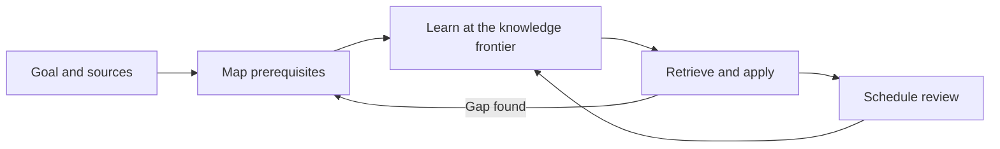

# Curriculer

**Learn anything. A curriculum builder and LLM tutor for any subject, built on
prerequisites, mastery, automaticity and spaced retrieval.**

The course is plain files, so you can read it and correct it.

## Why

Knowledge is not a list of facts. It is a graph of connected ideas and skills.
Advanced concepts depend on simpler concepts, so a weak prerequisite can make
later work unnecessarily hard. A single AI lesson cannot provide a complete path
through a large subject.

The curriculum holds the course plan in one place. Curriculer helps an LLM turn
a goal, suggested topics, and source material into an ordered course. The course
starts with prerequisites and builds toward the goal. If the learner has a gap,
the agent will automatically move back through the graph and reinforce it.

### Automaticity

Working memory is limited. If a basic skill needs conscious effort, less capacity
remains for complex work. Automaticity is the fast and reliable use of
lower-level knowledge. It frees attention for higher-level reasoning. Curriculer
gives its top score only to recall that is both quick and correct.

### Mastery

Mastery means that a learner can use a prerequisite with enough accuracy and
fluency to continue. Curriculer checks this before it adds more complexity. A
gap sends the learner back to the required knowledge or skill. Before a new
section, the tutor looks at the review state of the sections it builds on and
reviews any weak or overdue one first.

The course grows with the learner. When a question shows a missing foundation,
the tutor asks a question or two to find it, teaches it with a worked example,
and checks it with a fresh question. If no lesson covers it, the tutor offers
to add a short bridge lesson just before the lesson that needed it, with a few
flashcards, so it comes back in review. It adds one only when you agree, and it
never renumbers, renames or deletes a lesson.

### Spaced Retrieval

Recall weakens without use. Rereading can feel familiar, but it does not always
produce reliable recall. Curriculer uses questions, exercises, and quizzes for
retrieval practice. It records each result and schedules the next review.
Successful reviews move farther apart: each clean review about doubles the gap,
up to six months. Difficult material returns sooner.


```mermaid
flowchart LR
    A["Goal and sources"] --> B["Map prerequisites"]
    B --> C["Learn at the knowledge frontier"]
    C --> D["Retrieve and apply"]
    D --> E["Schedule review"]
    D -->|Gap found| B
    E --> C
```

For more background, see Justin Skycak on
[prerequisite knowledge](https://www.justinmath.com/thoughts-about-prerequisite-knowledge/),
[automaticity](https://www.justinmath.com/cognitive-science-of-learning-developing-automaticity/),
[mastery learning](https://www.justinmath.com/a-brief-history-of-mastery-learning/), and
[spaced repetition](https://www.justinmath.com/cognitive-science-of-learning-spaced-repetition/).

## What

Curriculer is a Markdown-first scaffold for local course folders. A course can
contain a curriculum map, lessons, sources, exercises, flashcards, quizzes, a
glossary, progress, and review dates.

An LLM can teach from these files, quiz the learner, record evidence, and choose
the next task. The state stays visible and portable. No database, hosted service,
or application is required.

The repository contains `_Course Scaffold/`, the `course-study-coach` skill,
agent rules, and a scaffold validator.

The skill lives in `.agents/skills/course-study-coach/`, where Codex finds it.
Claude Code finds the same skill through the `.claude/skills/course-study-coach`
symlink. On Windows, Git may check out that symlink as a small text file. Clone
with `git clone -c core.symlinks=true` (needs Developer Mode or an administrator
shell), or copy the skill folder into `.claude/skills/`.

The base repository does not contain real courses or learner history.

## How To Use It

A learning workspace is a separate folder for your courses. From the root of
this repository, copy the `course-study-coach` skill into it, where Codex and
Claude Code look for it. Copy the scaffold into it as it is, for the templates
the agent writes later sections from, and again as a course:

```sh
mkdir -p "/path/to/learning-workspace/.agents/skills" "/path/to/learning-workspace/.claude/skills"
cp -R .agents/skills/course-study-coach "/path/to/learning-workspace/.agents/skills/"
ln -s ../../.agents/skills/course-study-coach "/path/to/learning-workspace/.claude/skills/course-study-coach"
cp -R "_Course Scaffold" "/path/to/learning-workspace/"
cp -R "_Course Scaffold" "/path/to/learning-workspace/My Course"
```

On Windows, a link needs Developer Mode or an administrator shell. Instead of
the `ln -s` line, copy the skill folder into `.claude/skills/` as well. The
upgrade command below keeps both copies up to date.

Open your agent at the workspace root, the folder that holds `.agents/`,
`.claude/` and your course folders, so it finds the skill and sees every course.
For another course, run only the last `cp` line again with a new name.

Then:

1. Put any sources you want the course to follow in `_attachments/`, or let the
   agent pick them.
2. Tell the agent your goal. It sets the course up with `00 Course Setup Grill.md`:
   one short question at a time, starting with your level and what the course is
   for. It fills in the rest with recommended answers you can change.
3. Say "Just create the course" after those two answers, or say yes to the
   section plan it proposes. The agent maps prerequisites into the full course
   map, writes the first lesson, and asks its first question, a few minutes
   later. It writes each later lesson when you reach it. Ask it to write the
   rest now if you want the whole course at once.
4. Use `course-study-coach` to learn, practice, review, and take quizzes. When
   you reach a new section, it first checks the sections it builds on, then
   opens it in a few sentences and a question that its first lesson answers.
5. Let the agent update progress and review dates from study evidence.

Example prompts:

```text
Build this course from my goal and source files.
Find where I left off and start the next useful task.
Quiz me on due material and update my review data.
```

To upgrade a learning workspace to a new release, update this repository and run:

```sh
python3 scripts/upgrade_workspace.py "/path/to/learning-workspace"
```

It replaces the skill and the workspace's `_Course Scaffold/`, and brings the
rules each course copied up to date, as the [changelog](CHANGELOG.md) says. It
never changes your lessons, cards, quizzes or review dates. It backs up what it
changes in the workspace's `.curriculer/backups/` and says what it changed. Add
`--check` to see what it would change first, or `--commit` to commit the upgrade
in the workspace's Git repository.

Do not create real courses inside this base repository. Copy the scaffold first.

Before you change the scaffold, run:

```sh
python3 scripts/validate_curriculer.py --mode scaffold
```

To check a course, run the same script with `--mode course --course "/path/to/learning-workspace/My Course"`.
If the learning workspace is a Git repository, add `--since <commit>` to check
that no lesson present at that commit was renamed, moved or deleted.

See [CONTRIBUTING.md](CONTRIBUTING.md) for contribution rules.

## License

MIT. See [LICENSE](LICENSE).
